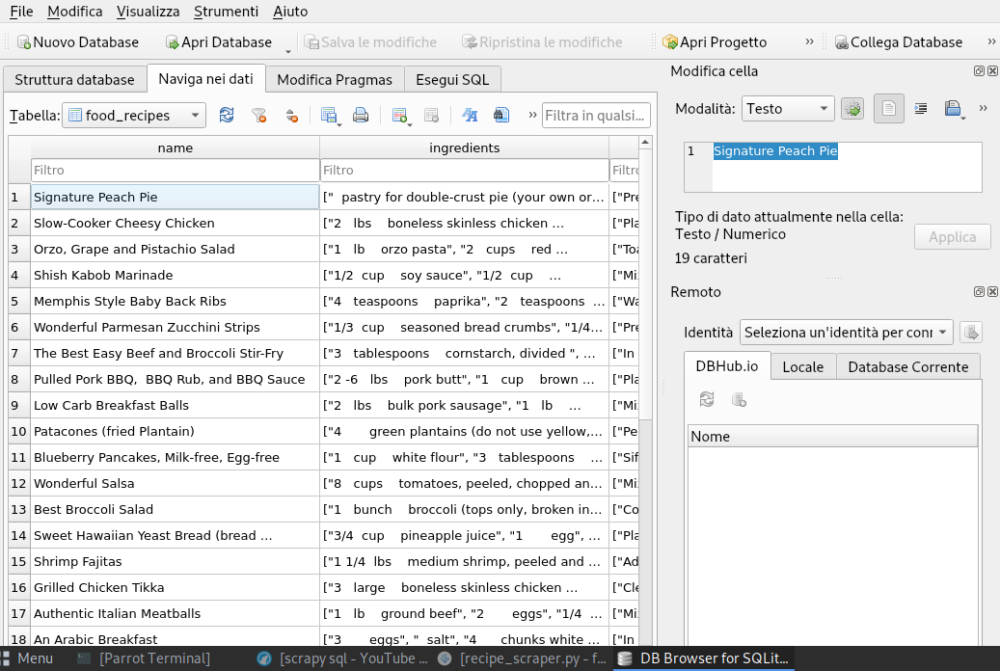

# recipes-scraper
Scraper built by using Scrapy framework

## Description
Scraping bot built by using Scrapy framework that store the data into a SQLite database.
This process can be achieved by customizing the pipeline.py file.

## Run Locally
Clone the project
```bash
  git clone https://github.com/maxcohen31/recipe-scraper.git
```
## Directory Structure
```bash
recipescraper
    ├── recipescraper
    │   ├── __init__.py
    │   ├── items.py
    │   ├── middlewares.py
    │   ├── pipelines.py
    │   ├── __pycache__
    │   │   ├── __init__.cpython-39.pyc
    │   │   ├── items.cpython-39.pyc
    │   │   ├── pipelines.cpython-39.pyc
    │   │   └── settings.cpython-39.pyc
    │   ├── settings.py
    │   ├── spiders
    │   │   ├── food.csv
    │   │   ├── __init__.py
    │   │   ├── __pycache__
    │   │   │   ├── __init__.cpython-39.pyc
    │   │   │   └── recipe_scraper.cpython-39.pyc
    │   │   └── recipe_scraper.py
    │   └── SQLiteDB.png
    └── scrapy.cfg
```
## Setup a virtual enviroment
```bash
virtualenv recipescraper ; source bin/activate
pip install scrapy
```

## Go to the project directory
```bash
  cd recipescraper
  cd recipescraper/recipescraper/spiders/
```

## Run the crawler
```bash
  python3 recipe_scraper.py
```
 ## SQLite
 
 
